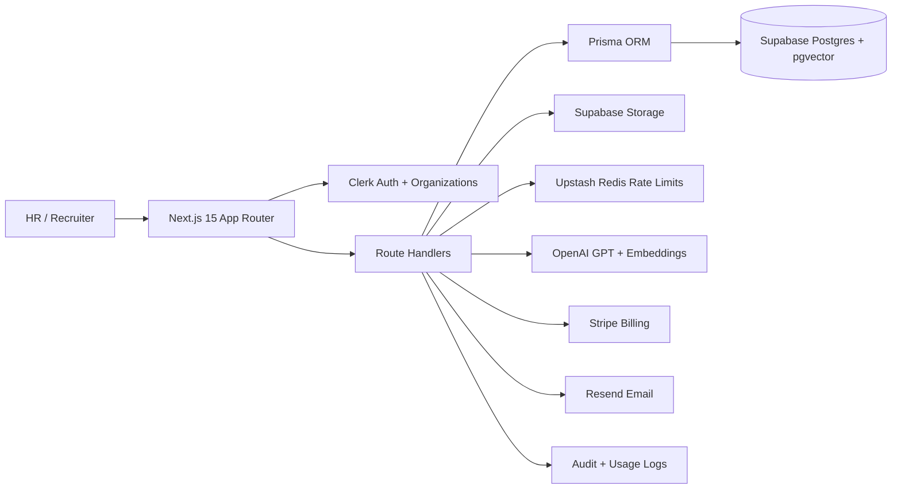

# Resume Parser Architecture

The app uses Clerk for user and organization identity. Route handlers enforce authentication, rate limits, validation, audit logs, and usage tracking. Resume uploads are stored in Supabase Storage, text is extracted from PDF/DOCX files, OpenAI returns strict structured JSON, and searchable candidate records are persisted in Postgres through Prisma. Embedding rows support pgvector semantic search.

## Core Modules

- `app/`: Landing page, auth screens, protected dashboard, and REST API routes.
- `components/`: Reusable UI primitives, dashboard shell, landing experience.
- `lib/`: Auth, Prisma, Supabase, Stripe, OpenAI, parsing, validation, rate limiting, and notifications.
- `prisma/schema.prisma`: Production data model for users, organizations, candidates, resumes, ATS scores, analytics, API keys, usage, billing, embeddings, and audit logs.
- `docs/openapi.yaml`: Public REST API contract.
