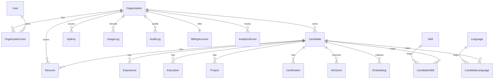

# ER Diagram

```mermaid
erDiagram
  Organization ||--o{ OrganizationUser : has
  User ||--o{ OrganizationUser : joins
  Organization ||--o{ Candidate : owns
  Organization ||--o{ Resume : stores
  Candidate ||--o{ Resume : has
  Candidate ||--o{ Experience : has
  Candidate ||--o{ Education : has
  Candidate ||--o{ Project : has
  Candidate ||--o{ Certification : has
  Candidate ||--o{ AtsScore : receives
  Candidate ||--o{ Embedding : indexes
  Organization ||--o{ ApiKey : issues
  Organization ||--o{ UsageLog : records
  Organization ||--o{ AuditLog : audits
  Organization ||--|| BillingAccount : bills
  Organization ||--o{ AnalyticsEvent : tracks
  Skill ||--o{ CandidateSkill : maps
  Candidate ||--o{ CandidateSkill : maps
  Language ||--o{ CandidateLanguage : maps
  Candidate ||--o{ CandidateLanguage : maps
```
